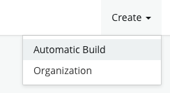
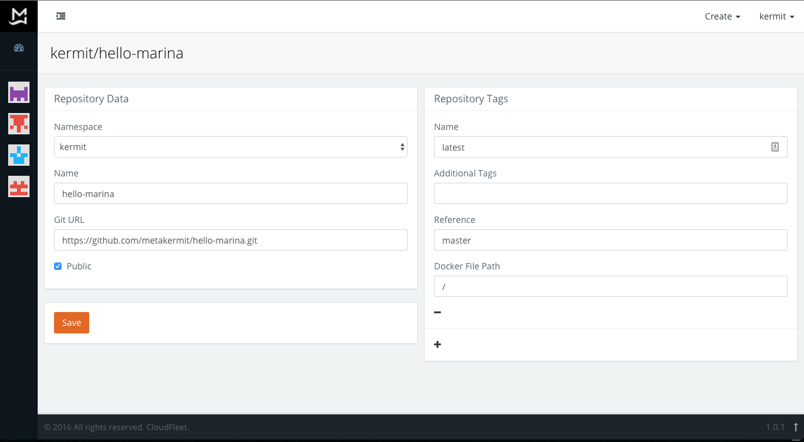
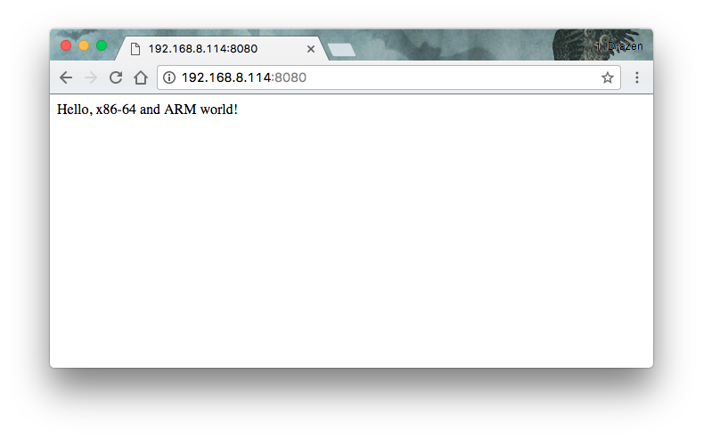
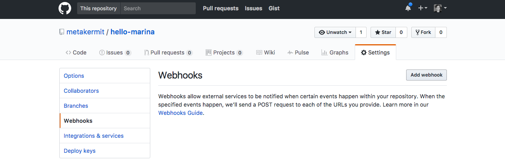

# Getting started – Raspberry Pi

In this tutorial we will show you how to develop a small website
served on Nginx, "dockerize" it to on your laptop
(for x86-64 architectures) and then deploy
that Docker container seamlessly to your Raspberry Pi B 2 or 3.
We will be using marina.io to automatically build a Docker image
that works on ARM devices – all from the same git repository!

## Create your Docker image

For the purposes of this tutorial, we'll create a simple website we'll host
using nginx. As a basis we'll use the
[official Nginx Docker image](https://hub.docker.com/_/nginx/) that normally
only works on x86-64 machines.
We assume you have [Docker](https://www.docker.com/) installed
on your laptop since you're reading this :)

Start by creating a project folder:

    mkdir hello-marina
    cd hello-marina

Let's write our mighty website by creating an *web* folder and an *index.html*
file inside it with the following contents:

```
Hello, x86-64 and ARM world!
```

Let's go ahead and create a *Dockerfile* back in the root of our *hello-marina*
project directory and edit it to contain:

```
FROM nginx:latest
COPY web /usr/share/nginx/html
```

You can see the correct example file layout in
[this repository](https://github.com/metakermit/hello-marina.git).

Now let's build this Docker image locally and run it as a new container.

    docker build -t hello-marina .
    docker run -it -p 8080:80 hello-marina

If you now open <http://localhost:8080> you will hopefully see our lean & agile
website rendered. Awesome!

Now we'll make a git repository and push it to [GitHub](https://github.com/).

    git init
    git add -A
    git commit -m "the website"
    git remote add origin https://github.com/yourusername/hello-marina.git # modify!
    git push -u origin master

Now your files should be on GitHub. At this point, you'd be able to deploy
your image to x86-64 VMs using [Docker Hub](https://hub.docker.com), but we want
to deploy it on our Raspberry Pi, so we need marina.io. On to the next phase…

## Build the ARM image on marina.io

Before you can build your project for ARM on marina.io, you will need to
[register a marina.io account](https://marina.io/auth/register), so go ahead and
do that now. Done? Great!

First, create a new automatic build by going to Create - Automatic Build in the
upper right corner after logging in.



Now fill out your "git url" by pasting in your git remote url
(the HTTPS version), adding a tag "latest" tied to the "master" branch on git
(the defaults), mark the repo as "public"
and fill out the name as "hello-marina".
The build settings should look something like this:



Click "Save" when you're done.

Now if you go back to your images by clicking your username in the sidebar
to the left, you should see the hello-marina image. Click on it and click the
"Build" button (we will later show how to automate this).

This will trigger marina.io to go fetch the source code from
GitHub, prepare an ARM version of the Docker image and build it. In the "Builds"
panel you will see the status change from "assigned" to "built"
to a green "pushed" state once
it's successfully been pushed to the marina.io Docker registry.

## Set up your Raspberry Pi

You will need a Raspberry Pi B 2/3 that you can connect to
and Docker installed on it. If you already have a Pi with
[Raspbian](https://www.raspberrypi.org/downloads/raspbian/) ready,
you can install Docker easily these days with a single command:

    curl -sSL https://get.docker.com | sh

Otherwise, there is a more complete tutorial for setting up a Raspberry Pi
[here](http://blog.alexellis.io/getting-started-with-docker-on-raspberry-pi/).

To be able to pull your Docker image from marina.io to your Raspberry Pi,
you can anonymously pull from our marina.io registry.

*In the future we might require you
to first authenticate with our armhf registry
with the same username / password
you used when registering to marina.io, e.g.:*

    docker login armhf.registry.marina.io

*If your ARM device was 64-bit, you'd log in to this registry url instead:*

    docker login aarch64.registry.marina.io

Now you simply pull and run the image using this command
(be sure to substitute with your username):

    docker run -it -p 8080:80 armhf.registry.marina.io/yourusername/hello-marina

If you open the local IP address of your Raspberry pi on port 8080
from your browser, you should see the same website as the one you developed
on your laptop – and the container is running on ARM now.
One codebase – two computer architectures. Magic!



You can now set up port forwarding on your router to the Raspberry Pi port 8080
and serve the website to the whole world :)

## Automatic builds after every commit

To enable this, you need to add a GitHub hook to your repository. Open your repo
settings on GitHub, then under Webhooks click "Add webhook".




Fill in the details:

- payload url: copy from your profile page
- content type: "application/json"
- which events: "just the push event"
- secret: The API key from your profile
- active: yes

and click "Update webhook" once you're done.

Now after each commit you make to your GitHub repository, marina.io will build
a new version of your Docker image. Splendid!
